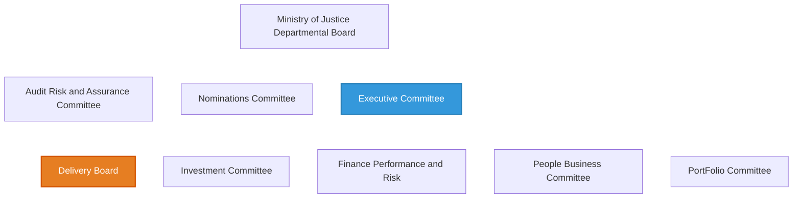

# Current Data Strategy and Governance - Overview

* While it's a challenge to focus across ALL areas, given the scope of the Digital Strategy document, there are two key issues which are inexorably linked...

  1. Legacy Systems.
  2. User experience, impacting both staff and prisoners.
  3. Here comes <del>our new robot overlords</del> AI.

---
> **TODO:** Evaluation (using a particular method) and Gap Analysis
> ### Milestone 1: Evaluate your organisations data stratey and governance
>
> Use Principals of leadership to thoroughly evaluate your organisations relationship between data strategy, data governance and value (wk 3)
>
> 4 minutes
> * Overview of the organisations current data strategy and governance
> * Evaluation of current data governance approaches, model proposals and data quality enhancements
> * Gap analysis of potential improvements

