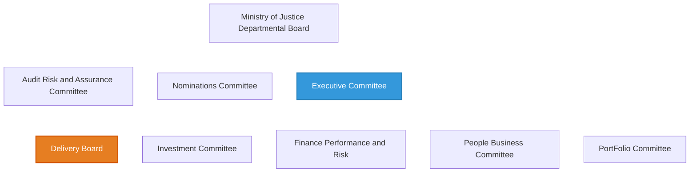
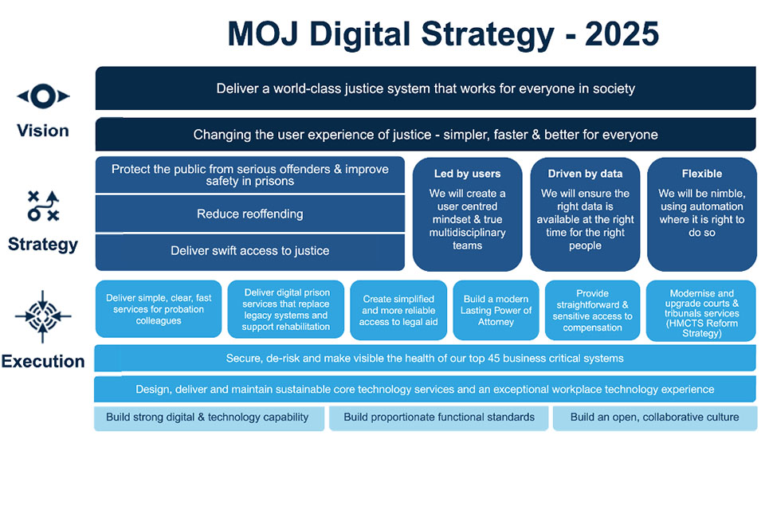

# Current Data Strategy and Governance

[(4)](./references_1.md#our-governance)

[(5)](./references_1.md#digi-strategy-2025)[/(6)](./references_1.md#ministry-of-justice-digital-strategy-2025)

[(4)](./references_1.md#our-governance)

