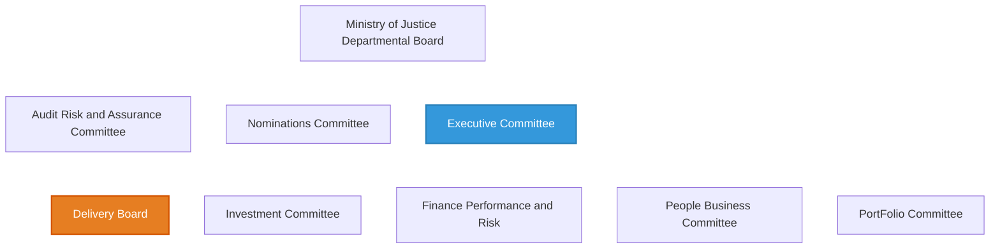
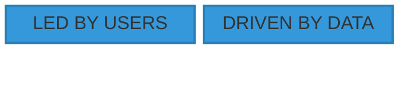

# Current Data Strategy and Governance

[(4)](./references_1.md#our-governance)

[(5)](./references_1.md#digi-strategy-2025)[/(6)](./references_1.md#ministry-of-justice-digital-strategy-2025)

[(4)](./references_1.md#our-governance)

---
> ### Milestone 1: Evaluate your organisations data stratey and governance
>
> Use Principals of leadership to thoroughly evaluate your organisations relationship between data strategy, data governance and value (wk 3)
>
> 4 minutes
> * Overview of the organisations current data strategy and governance
> * Evaluation of current data governance approaches, model proposals and data quality enhancements
> * Gap analysis of potential improvements
>
> #### live session notes
> What is organistional strategy? - How to Win - trade offs in order to become the top dog.
> Business strategy for government != Profit driven 
> Three pillars -> what are these?
>
> Data Strategy - the different ways data is used, how it's used to achieve our organisational goals -> what's the purpose of the data
> Maturity level, what is the maturity of the organisation in terms of data strategy?
>
> Look at the data governance module? - What is Data Governance/role definitions. Data Governance Frameworks
> - Goals, Methods, People, Processes, Tech, Culture.
>
> Organisational strategy -> Data Strategy -> Data Governance -> 
>                                -? What's not going well particularly -> this is inherantly abstract.
>                                -? Come up with a nailed down example of what's going wrong

