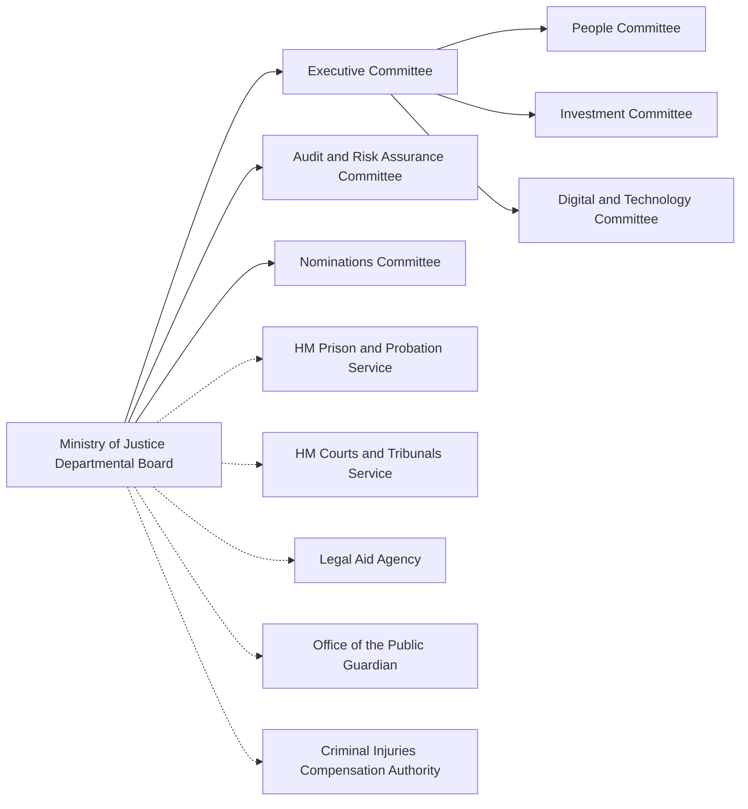

# Current Data Strategy and Governance - Overview

---
> ### Milestone 1: Evaluate your organisations data stratey and governance
>
> Use Principals of leadership to thoroughly evaluate your organisations relationship between data strategy, data governance and value (wk 3)
>
> 4 minutes
> * Overview of the organisations current data strategy and governance
> * Evaluation of current data governance approaches, model proposals and data quality enhancements
> * Gap analysis of potential improvements

