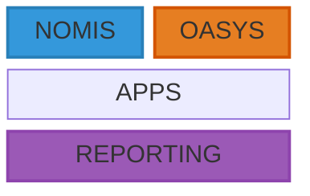

# Organisational Evaluation

* NOMIS - National Offender Management Information System 
    * Legacy Oracle database that has been used to manage prisoners and probationers. 
    * Original incarnation in 2004, updated in 2017.

* OASYS - Offender Assessment System
    * Legacy Oracle based system used to asses the risk of re-offending.

