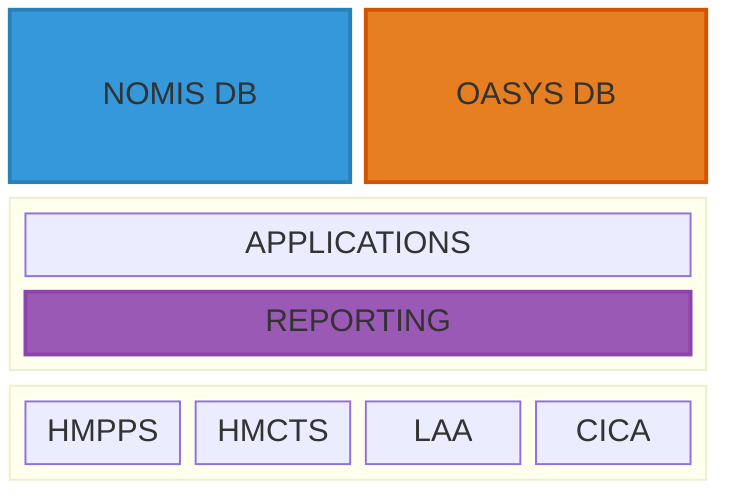

# Organisational Evaluation

* NOMIS - National Offender Management Information System 
    * Legacy Oracle database that has been used to manage prisoners and probationers. 
    * Original incarnation in 2004, updated in 2017.

* OASYS - Offender Assessment System
    * Legacy Oracle based system used to asses the risk of re-offending.

* HMPPS - Her Majesty's Prison and Probation Service
* HMCTS - Her Majesty's Courts and Tribunals Service
* LAA - Legal Aid Agency
* CICA - Criminal Injuries Compensation Authority
* and more...

**There are a LOT of bodies relying on this data.**

Unlike many other departments though, the MoJ has a CTO! 
