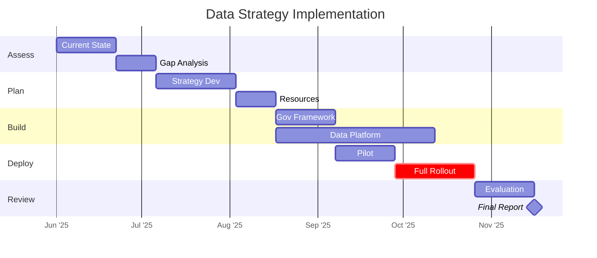

# Timescales for Change

```mermaid
gantt
    title Data Strategy Implementation
    dateFormat YYYY-MM-DD
    axisFormat %b '%y
    tickInterval 1month
    
    section Assess
    Current State   :a1, 2025-06-01, 3w
    Gap Analysis    :a2, after a1, 2w
    
    section Plan
    Strategy Dev    :a3, after a2, 4w
    Resources       :a4, after a3, 2w
    
    section Build
    Gov Framework   :a5, after a4, 3w
    Data Platform   :a6, after a4, 8w
    
    section Deploy
    Pilot           :a7, after a5, 3w
    Full Rollout    :crit, a8, after a7, 4w
    
    section Review
    Evaluation      :a9, after a8, 3w
    Final Report    :milestone, after a9, 0d
```

---
> **Notes**
>
> 