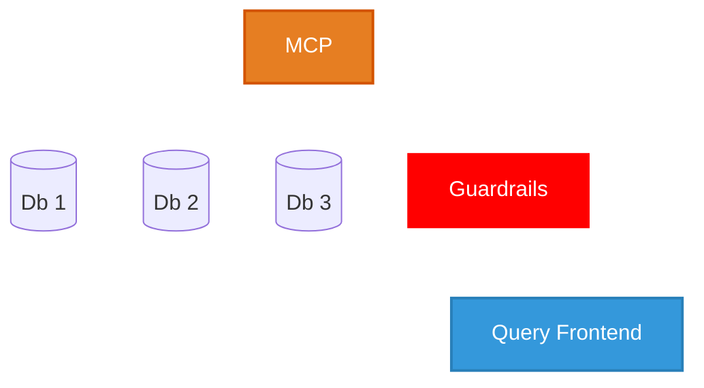

# Implementation

## Stakeholders
* Executive Board and SLT
  * Drive change
* Security Team
  * Legitimacy and Confidence
* Data and Reporting Team
  * Evangelise Internally

---
> ### Milestone 3: Create an Implementation Plan For Your Proposal
> For your proposed change, deliver a compelling proposal focussed on the business impact of your data strategy recommendation. 
> Include a detailed implementation plan, considering potential limitations and risks to inform the impace and scalability of your proposal (wk9)
>
> 4 minutes
> * Detailed plan for implementing the proposed changes, including steps, timelines and key stakeholders
> * Analysis of potential limitations and risks associated with the proposal
> * Strategies for mitigating risks and addressing limitations to ensure scalability and impact
