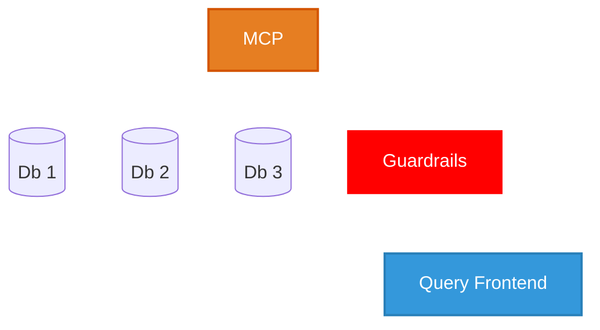

# Implementation

* MCP - model context protocol [(9)](./references_1.md#model-context-protocol)
* Guardrails - PII blocking [(10)](./references_1.md#guardrails-sensitive-filters)
* Query Frontend - democratized access to data

## Stakeholders and Change Process
* Executive Board and SLT
  * Drive change
* Security Team
  * Legitimacy and Confidence
* Data and Reporting Team
  * Evangelise Internally

## Kotter's 8 steps
* A problem-centered model for change
* Existing state != ideal state

| Step    | Details |
|---------|---------|
| Urgency | Executive Board and SLT elect to drive changes |
| Coalition | Bring in the Security Team and Data and Reporting Team |
| Vision  | Work on the vision & strategy together |
| Communication | Communicate the vision and benefits internally |
| Empower | Uncover obstacles |
| Short-term wins | Concentrate on an internal POC |
| Consolidate | Build out the product & test internally |
| Anchor | Re-affirm the vision, strategy and outcomes before public go-live |

