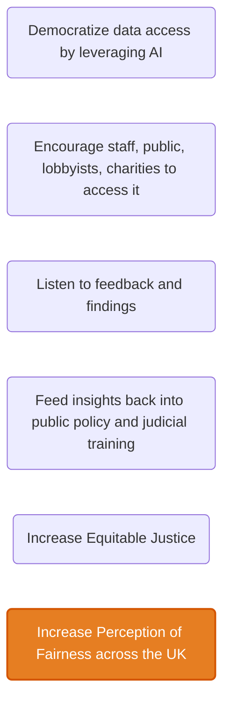

# Conclusion

```mermaid
flowchart TD
  A(Democratize data access by leveraging AI)
  B(Encourage staff, public, lobbyists, charities to access it)
  C(Listen to feedback and findings)
  D(Feed insights back into public policy and judicial training)
  E(Increase Equitable Justice)
  F(Increase Perception of Fairness across the UK)

  A --> B
  B --> C
  C --> D
  D --> E
  E --> F

  style F fill:#e67e22,stroke:#d35400,color:white,stroke-width:2px
  linkStyle 0,1,2,3,4 stroke:#ffffff,stroke-width:2px
```
