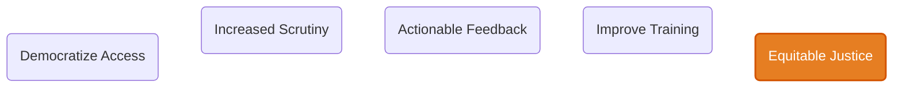

# Conclusion

* Democratize Access  - AI, MCP and PII blocking allows wider access to data
* Increased Scrutiny  - Leads to more transparency, wider range of insights
* Actionable Feedback - Insights are surfaced to improve justice outcomes
* Improve Training    - Training is likely needed to effect real change
* Equitable Justice   - Fair application of justice/law interpretations

**Justice can tend towards being applied fairly across race/cultures/other dimensions**
* The gap in outcomes between white vs. ethnic minority offenders should tend towards zero
  * Dimensions across sentencing, re-offending and conviction rates
  * Achievable by increasing training around fairness and bias in sentencing
  * Driven by transparency in data reporting this is a realistic and desirable goal
* Where this _doesn't_ start lining up there is obviously also something else at play
  * Inconsistencies can be properly investigated 
  * Policies created to address these particular outliers
  * Ordinarily, anomalies wouldn't surface from data that can't be transparently scrutinized
* Allows commentators, as well as the MoJ itself, to rely on a publically available data-set
  * Reduces perception of bias as well as media or political exploitation of a lack of transparency
  * Drives improved perception of the MoJ from the outside, as well as internally
  * Improves cultural perception of the overall UK Justice system wrt fairness

**Caveat: These goals might take a number of years to manifest**